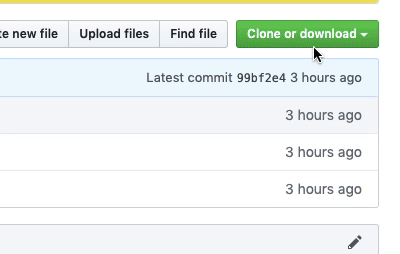

# Modem.js
A lightweight JavaScript UI library in under 100 lines of code.

### Getting started
First, clone this repository.



Then, create an `index.html` file with the following code:
````html
<div id="YourAppNameHere"></div>
````

After that, write this in a `.js` file:
````javascript
import { ModemCore } from 'modem_0.5-es.js';

var modem = new ModemCore();
modem.setup();
modem.setElement("YourAppNameHere");
````
Finally, add elements using the `addComponent` method:

````javascript
modem.addComponent("P", "Hello, World!");
````

### More
Want to play around with Modem.js? The [`playground` branch](https://github.com/redstone2010/modem-js/tree/playground) is for that.
